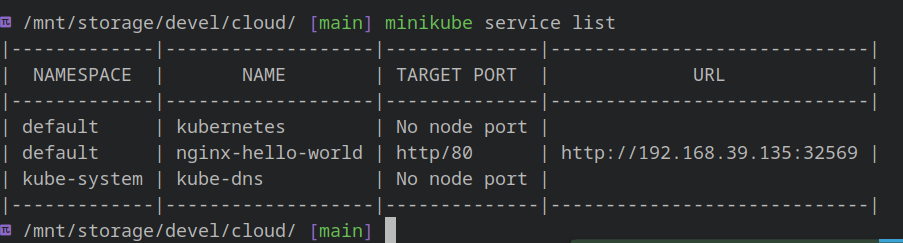

# HA Cluster Example with Setup

## Deployment

- Install `minikube` to simulate a cluster deployed on cloud with multiple nodes.

- Install `kubectl` to manage kubernetes cluster.

- Start the `minikube` cluster with appropriate hypervisor (KVM in this case).

- Check if cluster is up and running. In this case there is only 1 node, which contains both control plane and deployment pods, which is different from the HLD diagram above.

- Using the YAML file in the repository, we start the deployment of a cluster running Nginx web server. For high availability, it has a replica set of 3.

- Check the status of deployment and the pods that are running.

- The web server is now successfully running inside the `minikube` cluster, which is running inside a VM managed by `minikube`.

- To access the cluster from outside this VM, `minikube` has setup port forwarding to access the services in the cluster.

- We can access the web server from outside the cluster.

- We can test the auto healing feature by deleting 1 pod in the cluster.

- The web server will remain available even when 1 pod was deleted.

- Kubernetes will create another pod when it detects that its state is different from that specified in the YAML config file.

- We can bring down the cluster when we are done.

- Finally delete the `minikube` VM.

## Case study - Spotify

Spotify started using Kubernetes for deploying and managing their services on the cloud. They primarily use GKE for their managed Kubernetes solution on the cloud. When they started out, people that built the cluster were also responsible for managing them. They eventually had to create DevOps team for managing their infrastructure. To increase the productivity of their engineering team and to address frustrations with using `kubectl`, they started using `Backstage`, which is a service catalog which aggregates all data about a service and presents it in a consistent UI. This changes the idea from managing clusters to managing services, which is a more important business unit.

[Reference](https://engineering.atspotify.com/2021/03/designing-a-better-kubernetes-experience-for-developers/)
